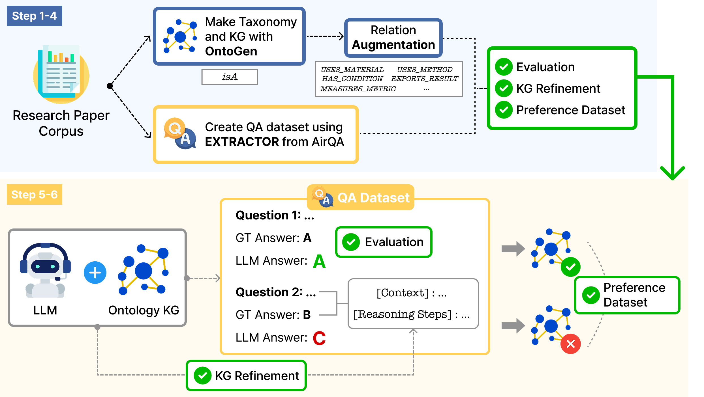
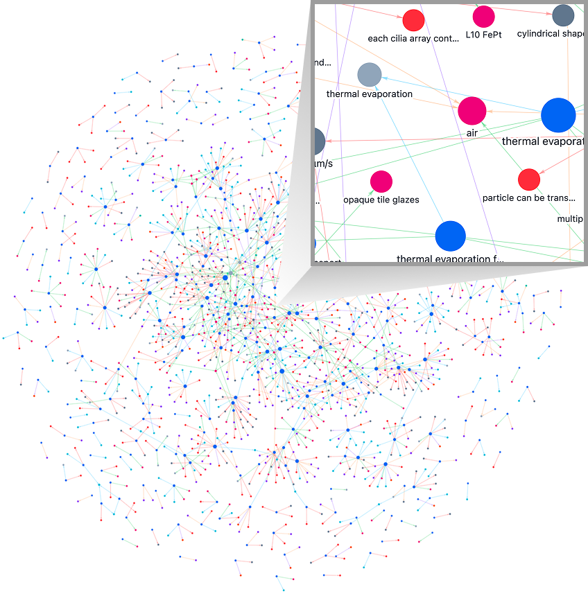

# OntoloGYM

OntoloGYM is an automated framework for building, evaluating, and refining
ontology-based knowledge graphs from scientific papers. It is designed for
materials-science corpora, where useful facts are often scattered across
methods, experiments, results, tables, figures, and condition-dependent
descriptions rather than appearing only in abstracts.

The project treats KG construction as a generate-evaluate-refine loop. It
collects and parses papers, generates AirQA-style question-answer datasets,
builds an OntoGen taxonomy, augments the graph with evidence-grounded
experimental relations, evaluates KG-grounded answers with GraphRAG, and keeps
failed QA cases available for refinement or preference-data construction.

## Pipeline Overview

OntoloGYM starts from a research-paper corpus and produces both evaluation data
and ontology-based KGs. The taxonomy stage provides the hierarchical `isA`
backbone, while relation augmentation adds typed scientific claims such as
materials used, methods applied, experimental conditions, measured metrics, and
reported results. The resulting KG is then tested through QA, and failed cases
can be converted into additional evidence-grounded refinement claims.



## KG Example

The generated graph links paper-derived concepts to concrete experimental
evidence. A relation-rich KG can capture not only taxonomy structure, but also
the methods, materials, conditions, metrics, and reported findings needed for
scientific QA.

<p align="center">
  
</p>

## Repository Layout

- `paper_crawling/`: candidate-paper retrieval, ranking, PDF URL enrichment, and open-access PDF download.
- `qa_extractor/`: copied AirQA extractor code plus the support modules it uses.
- `ontogen/`: copied OntoGen code, excluding generated examples, notebooks,
  caches, and bundled sample data.
- `relation_augmentation/`: evidence-based KG relation augmentation pipeline.
- `qa_evaluation/`: AirQA questions answered with KG context and scored with AirQA evaluators.
- `kg_refinement/`: failed-QA-driven relation refinement.
- `configs/`: user-editable settings split by pipeline.
- `data/papers/`: shared input folder. Folder-style inputs are preferred:
  `Journal_or_Conference_0/<paper json>` plus `figures/`.
- `data/<run_id>/`: connected outputs from one experiment run.
- `config.py`: compatibility layer that re-exports `configs/`.
- `.env`: shared API/provider secrets, based on `.env.example`.

The paper data formats are intentionally not converted here. Parsed JSON is
normalized only inside each run folder. Image paths are preserved in
`input_papers.json`, AirQA metadata, and OntoGen `processed_data` for later
multimodal work.

## Running

Run from the repository root:

```bash
python -m paper_crawling
python run_pipeline_sequence.py
python run_qa_extractor.py
python run_ontogen.py
python run_relation_augmentation.py
python run_qa_evaluation.py
python run_kg_refinement.py
python run_kg_visualization.py
```

Historical thesis experiments, model-comparison runs, and ablation repro
scripts live in `experiments/`. Those scripts usually depend on local
`data/<run_id>/` artifacts and are not part of the default pipeline surface.

## Configuration

All runners read `configs/` through `config.py`; no command-line arguments are
required. `run_pipeline_sequence.py` creates a new `data/<run_id>/` folder
and runs the configured order. Individual runners reuse the active run recorded
in `data/_active_run.txt`, unless `configs/common.py` is set to create a
new run.

Provider keys belong in `.env`, based on `.env.example`. Most runtime behavior,
including paper sources, QA generation, OntoGen stages, relation extraction,
GraphRAG retrieval, and refinement, is controlled from the files in `configs/`.
